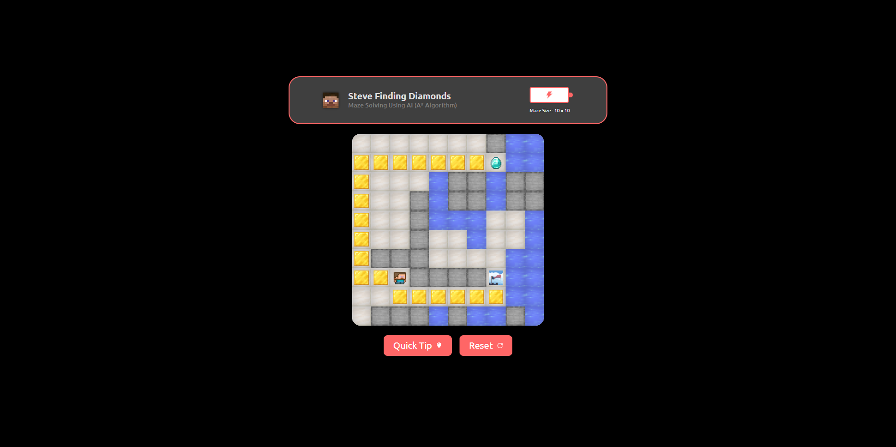

# Maze Solver Using A* Algorithm

This repository contains an implementation of the A* algorithm to solve mazes. The A* algorithm is a popular and efficient pathfinding algorithm used to find the shortest path from a start point to a goal point in a maze.

## Features

- **Algorithm Implementation**: Detailed implementation of the A* algorithm for maze solving.
- **Heuristic Function**: Customizable heuristic function to guide the search process.
- **Visualization**: Graphical representation of the maze and the path found by the algorithm.
- **Intelegence**: best performance in different maze configurations.

## How It Works

1. **Initialization**: Define the maze( walls , water, lava , sand ), start point ( steve ), and goal point( diamond ).
2. **Pathfinding**: Use the A* algorithm to explore the maze and find the shortest possible stone path ( Stay away from barriers as much as possible ) .
3. **Visualization**: Display the maze with the start point, goal point, and the path found by the algorithm.

## Example

Below is an image showing the maze and the path found by the A* algorithm:

## Usage

1. **Setup**: Install the required dependencies ( `npm i` ).
2. **Run the Script**: Execute the script to solve the maze and visualize the solution ( `npx vite --port=4000` ) [or any port you want].
3. **Use it in browser**: localhost:4000 [or your early setted port].

This project demonstrates the application of the A* algorithm to solve a classic pathfinding problem in a visually intuitive and efficient manner.
